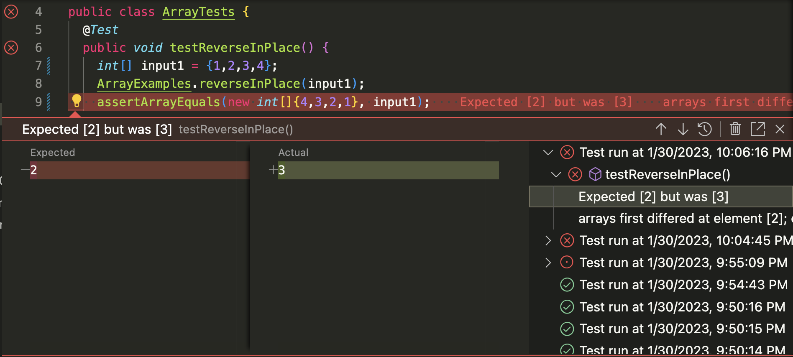

# PART 1: Server StringServer
Following is the java code for StringServer:-
```Java
import java.io.IOException;
import java.net.URI;

class Handler implements URLHandler {

    //private static final String WELCOME_MESSAGE = "Welcome!"; 
    String message = new String();    
    public String handleRequest(URI url) {
        if (url.getPath().equals("/")) {
            return String.format("Welcome!");
        } else{
            if (url.getPath().contains("/add-message")) {
                String[] parameters = url.getQuery().split("=");
                if (parameters[0].equals("s")) {
                    message += parameters[1] + "\n";
                    return String.format(message);
                }
            }
            return "404 Not Found!";
        }
    }
}

class StringServer {
    public static void main(String[] args) throws IOException {
        if(args.length == 0){
            System.out.println("Missing port number! Try any number between 1024 to 49151");
            return;
        }

        int port = Integer.parseInt(args[0]);

        Server.start(port, new Handler());
    }
}
```
The following is the output for the code:-


## Input 1:-

## Output 1:-


We compile and run the StringServer.java file. The main method of the Java file is invoked, which in turn creates a new Server object.\
The server object uses the handleRequest method of the Handler class to handle all the URIs.\
The port number and a new handler object are passed as arguments to the server class. The URI is passed as arguments to the handleRequest method.\
The URI changes from `localhost:1983/` to `localhost:1983/add-message?s=My%20name%20is%20Arnav`\
The String `message` which was an empty string, now has `My name is Arnav` concatenated to it.


## Input 2:-

## Output 2:-


We compile and run the StringServer.java file. The main method of the Java file is invoked, which in turn creates a new Server object.\
The server object uses the handleRequest method of the Handler class to handle all the URIs.\
The port number and a new handler object are passed as arguments to the server class. The URI is passed as arguments to the handleRequest method.\
The URI changes from `localhost:1983/add-message?s=My%20name%20is%20Arnav` to `localhost:1983/add-message?s=This%20is%20for%20lab%20report`\
The String `message` which had the string `My name is Arnav`in it, now has `This is for lab report` concatenated to it.


# PART 2: Fixing 🐛s!

## 1. Error inducing input:-
```Java
public class ArrayTests {
	@Test 
	public void testReverseInPlace() {
    int[] input1 = {1,2,3,4};
    ArrayExamples.reverseInPlace(input1);
    assertArrayEquals(new int[]{4,3,2,1}, input1);
	}
```
## 2. Input which doesn't induce faliure:-
```Java
public class ArrayTests {
	@Test 
	public void testReverseInPlace() {
    int[] input1 = {6,8,0,8,6};
    ArrayExamples.reverseInPlace(input1);
    assertArrayEquals(new int[]{6,8,0,8,6}, input1);
	}
```
## 3. Symptom:-

## 4. Incorrect code:-
```Java
public class ArrayExamples {

  // Changes the input array to be in reversed order
  static void reverseInPlace(int[] arr) {
    for(int i = 0; i < arr.length; i += 1) {
      arr[i] = arr[arr.length - i - 1];
    }
  }
  ```
  
  ## 5. Corrected Code:-
  ```Java
  public class ArrayExamples {

  // Changes the input array to be in reversed order
  static void reverseInPlace(int[] arr) {
    int temp = 0;
    for(int i = 0; i < arr.length/2; i += 1) {
      temp = arr[arr.length - i - 1];
      arr[arr.length - i - 1] = arr[i];
      arr[i] = temp;
    }
  }
```

The code provided to us directly assigned the (arr.length - i - 1)<sup>th</sup> element of the array to the element at the i<sup>th</sup> index. This meant that the i<sup>th</sup> element was lost completely. The fixed code uses a temporary integer variable to store the value of the (arr.length - i - 1)<sup>th</sup> element. Then, the i<sup>th</sup> element is assigned to the (arr.length - i - 1)<sup>th</sup> element and the the value of the temporary variable is assigned to the element at the i<sup>th</sup> index. This allows the swap to happen without the loss of any information from the array.

# PART 3
